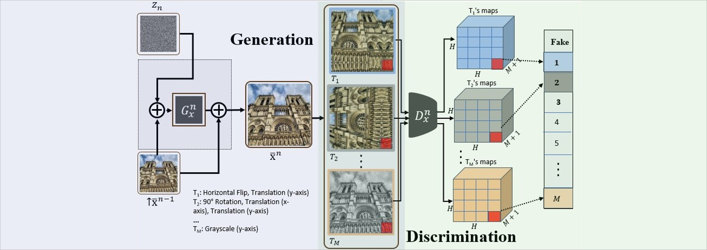
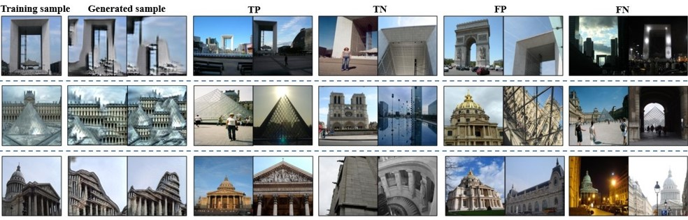
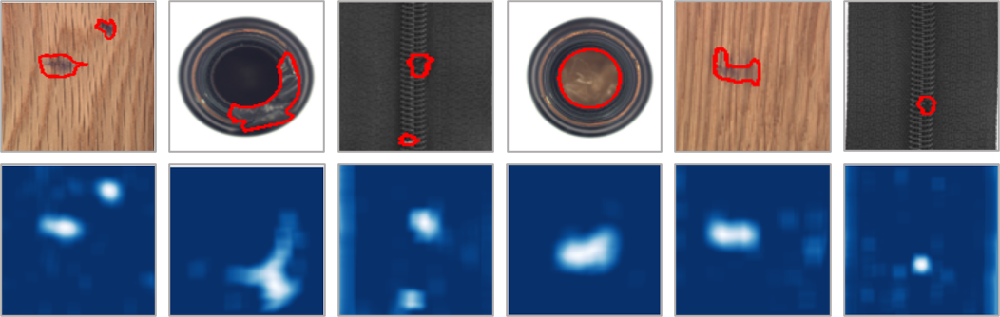

# A Hierarchical Transformation-Discriminating Generative Model for Few Shot Anomaly Detection

[Project](https://shellysheynin.github.io/HTDG/) | [Arxiv](https://arxiv.org/abs/2104.14535) 

### Official pytorch implementation of the paper: "HTDG: A Hierarchical Transformation-Discriminating Generative Model for Few Shot Anomaly Detection"

## Abstract 

Anomaly detection, the task of identifying unusual samples in data, 
often relies on a large set of training samples. 
In this work, we consider the setting of few-shot anomaly detection in images, where only a few images are given at training. We devise a hierarchical generative model that captures the multi-scale patch distribution of each training image. We further enhance the representation of our model by using image transformations and optimize scale-specific patch-discriminators to  distinguish between real and fake patches of the image, as well as between different transformations applied to those patches. The anomaly score is obtained by aggregating the patch-based votes of the correct transformation across scales and image regions. We demonstrate the superiority of our method on both the one-shot and few-shot settings, on the datasets of Paris, CIFAR10, MNIST and FashionMNIST as well as in the setting of defect detection on MVTec. In all cases, our method outperforms the recent baseline methods.




## Code

### Install dependencies

```
python -m pip install -r requirements.txt
```

###  Train
To train the model on mvtec/paris/cifar/mnist/fashionMnist:

```
python main_train.py  --num_images <num_training_images>  --pos_class <normal_class_in_dataset> --index_download <index_of_training_image> --dataset <name_of_dataset>
```

Common training options:
```
--min_size                  image minimal size at the coarser scale (default 25)
--max_size                  image minimal size at the coarser scale (default 64)
--niter                     number of iterations to train per scale
--num_images                number of images to train on (1,5,10 in the paper)
--size_image                the original image size 
--fraction_defect           the number of patches to consider in defect detection (recommended arguments: 0.01-0.1)
--pos_class                 the normal class to train on
--dataset                   paris/cifar/mnist/fashionmnist/mvtec
--random_images_download    "True" if training random images from the normal class (otherwise, specify the index of the training image in --index_download)
--devices_ids                for 10shot we have used --device_ids = 0 1 
```

##  Results and applications

Illustration of classification decisions made by a single-shot model trained on the Paris dataset. The first column is the training sample, then are random samples generated by the trained generative model. The other columns present samples from the test set of the Paris dataset that are either true positive (TP), true negative (TN), false positive (FP) or false negative (TN).


The model can be also used for defect detection. For example, in the following image we show localization of defects in MVTec test images for one-shot defect detection. In the top row there are the original images, in which the anomaly region is delineated in red. In the bottom row, the localization provided by our method.



See section 3.3 in our [paper](https://arxiv.org/abs/2104.14535) for more details.


### Citation
If you use this code for your research, please cite our paper

## Acknowledgements
The implementation is based on the architecture of [SinGAN](https://github.com/tamarott/SinGAN)


